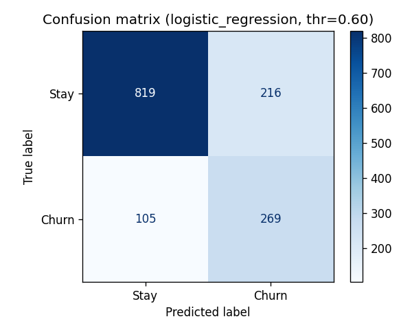
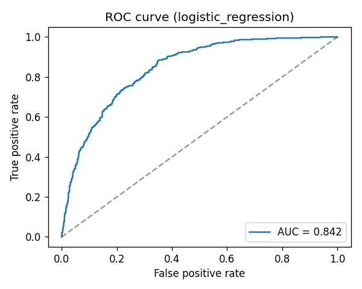
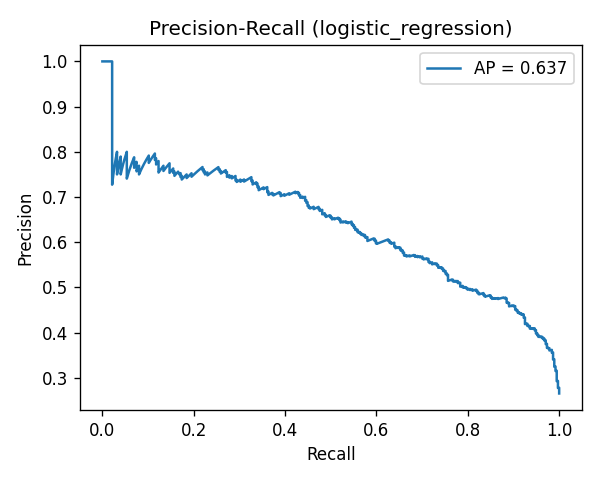

# Telco Customer Churn Prediction

An end-to-end machine learning project that predicts which telecom customers are
likely to **churn** (cancel their service), so the business can target them with
retention offers *before* they leave.

It walks through the full data-science lifecycle: **data-quality auditing →
cleaning → exploratory analysis → feature engineering → model comparison with
leak-free cross-validation → evaluation for an imbalanced problem → model
interpretation → business recommendations.**

> **Dataset:** [IBM Telco Customer Churn](https://www.kaggle.com/datasets/blastchar/telco-customer-churn) — 7,043 customers × 21 features. Target: `Churn` (Yes/No).

> **New to data science?** Read [`reports/Telco_Churn_Interview_Guide.pdf`](reports/Telco_Churn_Interview_Guide.pdf) — a plain-English walkthrough with a glossary of every term and an interview Q&A.

---

## Results

A simple, interpretable **Logistic Regression** matched the tree ensembles, so
it's the model we'd ship.

| Model | CV ROC-AUC (5-fold) |
|---|---|
| **Logistic Regression** | **0.846 ± 0.011** |
| Random Forest | 0.845 ± 0.009 |
| HistGradientBoosting | 0.830 ± 0.008 |

**Held-out test performance (tuned decision threshold = 0.60):**

| Metric | Score | What it means |
|---|---|---|
| ROC-AUC | **0.842** | Ranks a random churner above a random stayer 84% of the time |
| Recall (churn) | **0.72** | Catches ~72% of customers who actually churn |
| Precision (churn) | 0.55 | 55% of flagged customers really do churn |
| F1 (churn) | 0.63 | Balance of precision & recall |
| Accuracy | 0.77 | (Less meaningful here — see "class imbalance" below) |

**Top churn drivers** (permutation importance): `tenure`, `Contract`,
`InternetService`, `MonthlyCharges`.

### Diagnostic plots

| Confusion matrix | ROC curve | Precision-Recall |
|---|---|---|
|  |  |  |

---

## Key findings

- **Contract type is the #1 lever.** Month-to-month customers churn far more than
  those on 1- or 2-year contracts (no lock-in).
- **Churn is front-loaded in tenure.** New customers (< 12 months) are the
  highest risk; long-tenured customers rarely leave.
- **Fiber-optic internet and electronic-check payment** segments show elevated
  churn and deserve a pricing / experience review.
- **~26.5% of customers churn** — a class imbalance that makes raw accuracy
  misleading, so the project optimises ROC-AUC and recall instead.

---

## Repository structure

```
telco-churn-prediction/
├── data/
│   ├── raw/Telco-Customer-Churn.csv     # original dataset
│   └── processed/                       # generated clean table (gitignored)
├── notebooks/
│   └── 01_churn_analysis.ipynb          # the full narrated analysis
├── src/                                 # production-style, importable pipeline
│   ├── config.py                        # paths + constants
│   ├── data.py                          # load + clean
│   ├── features.py                      # feature engineering + preprocessing
│   ├── model.py                         # candidate models + pipelines
│   ├── evaluate.py                      # metrics + plots
│   └── pipeline.py                      # CLI: runs everything end to end
├── reports/
│   ├── 01_churn_analysis.html           # rendered notebook (no Jupyter needed)
│   ├── Telco_Churn_Interview_Guide.pdf  # plain-English guide + glossary + Q&A
│   ├── metrics.json                     # saved scores
│   └── figures/                         # saved plots
├── models/churn_model.joblib            # trained, ready-to-load pipeline
├── requirements.txt
└── README.md
```

The **notebook** is the place to read the story end to end. The **`src/`
package** is the same logic refactored into clean, reusable modules with a
command-line entry point — exploration vs. production, side by side.

---

## How to run

```bash
# 1. (optional) create a virtual environment
python3 -m venv .venv && source .venv/bin/activate

# 2. install dependencies
pip install -r requirements.txt

# 3a. reproduce the model, metrics, and figures from the command line
python -m src.pipeline

# 3b. or open the full analysis notebook
jupyter lab notebooks/01_churn_analysis.ipynb
```

Loading the trained model for inference:

```python
import joblib, pandas as pd
model = joblib.load("models/churn_model.joblib")
# model accepts a raw DataFrame with the original columns (minus customerID/Churn)
proba = model.predict_proba(new_customers)[:, 1]   # P(churn)
```

---

## Method highlights (what makes this rigorous)

- **No data leakage:** all scaling/encoding lives inside an sklearn `Pipeline`,
  so preprocessing is fit on training folds only during cross-validation.
- **Honest evaluation:** a stratified 80/20 hold-out test set is never touched
  during model selection or threshold tuning.
- **Right metrics for imbalance:** ROC-AUC / precision / recall instead of
  accuracy, plus a precision-recall curve.
- **Threshold tuning:** the decision cutoff is optimised for F1 on training data
  rather than left at the naïve 0.5.
- **Interpretability:** permutation importance (model-agnostic) + logistic-
  regression coefficients (direction of effect).
- **Reproducible:** fixed random seed and pinned dependencies.

## Next steps

- Calibrated probabilities for expected-value-based targeting
- SHAP values for per-customer explanations
- Interaction features and (if available) usage/complaint logs
- A monitoring loop to detect data/concept drift in production
